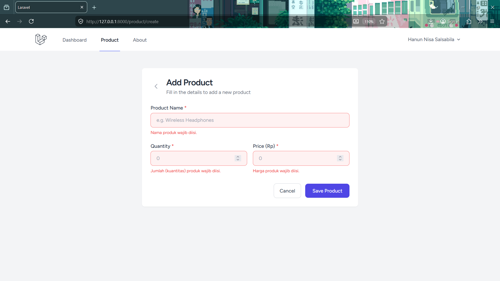
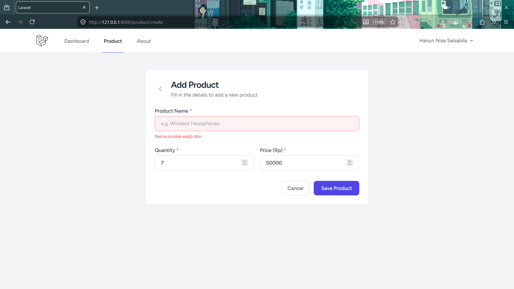
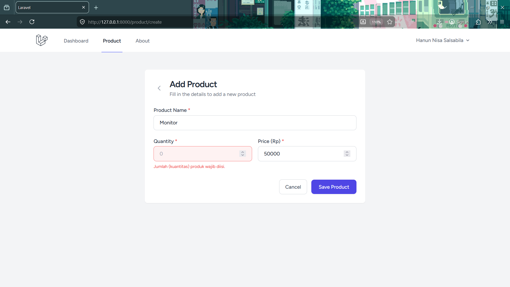
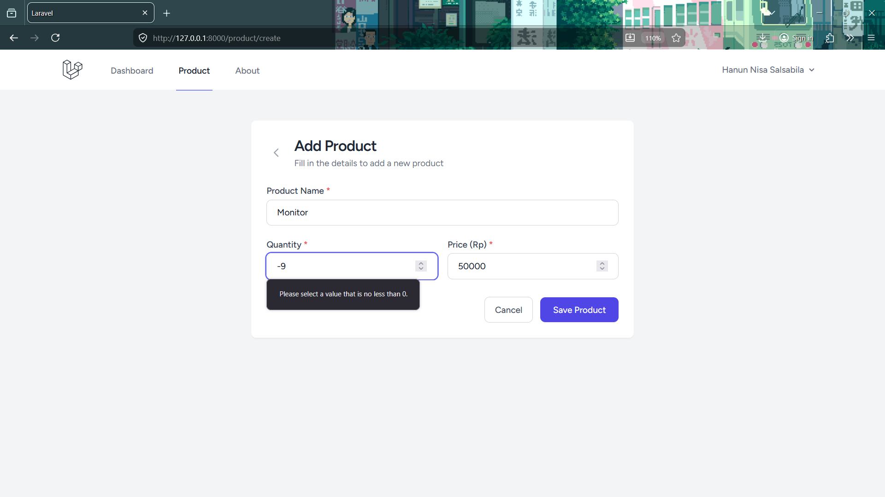
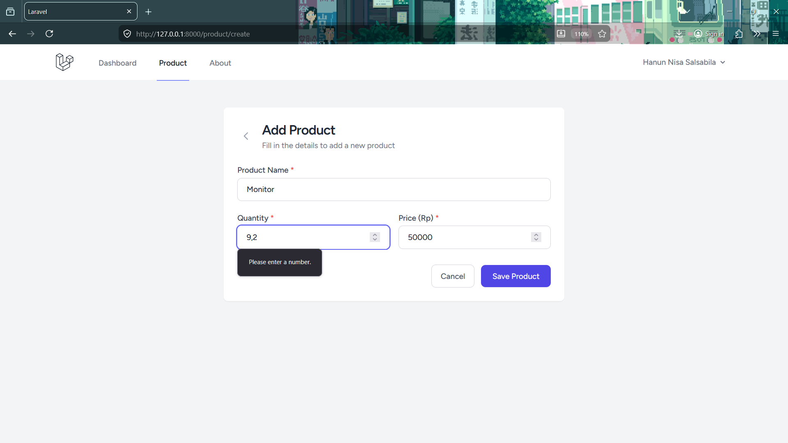
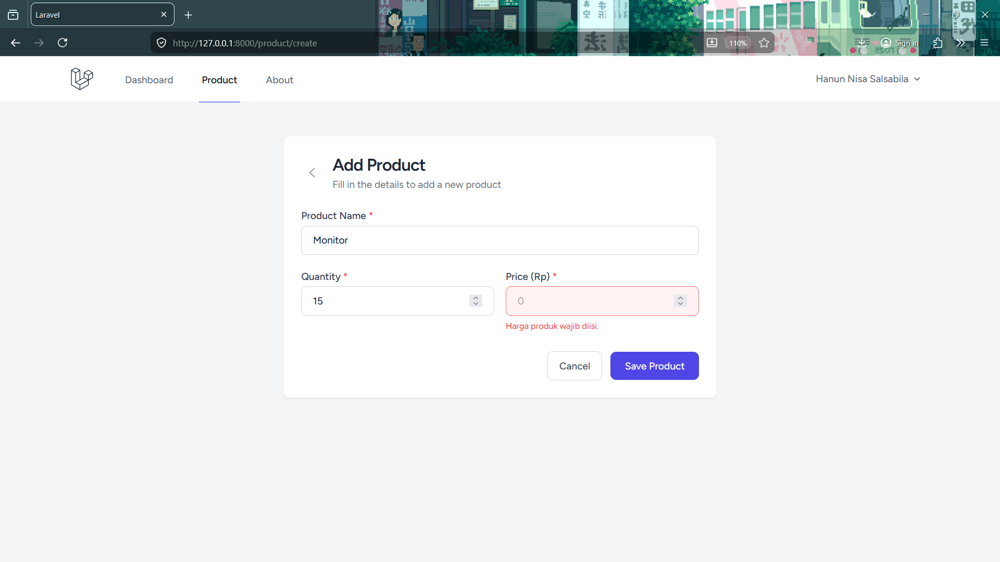
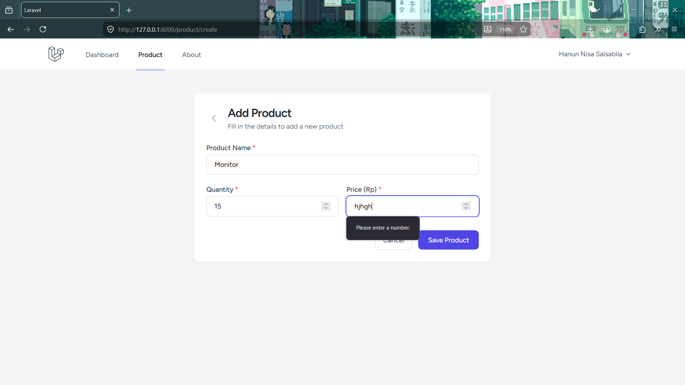
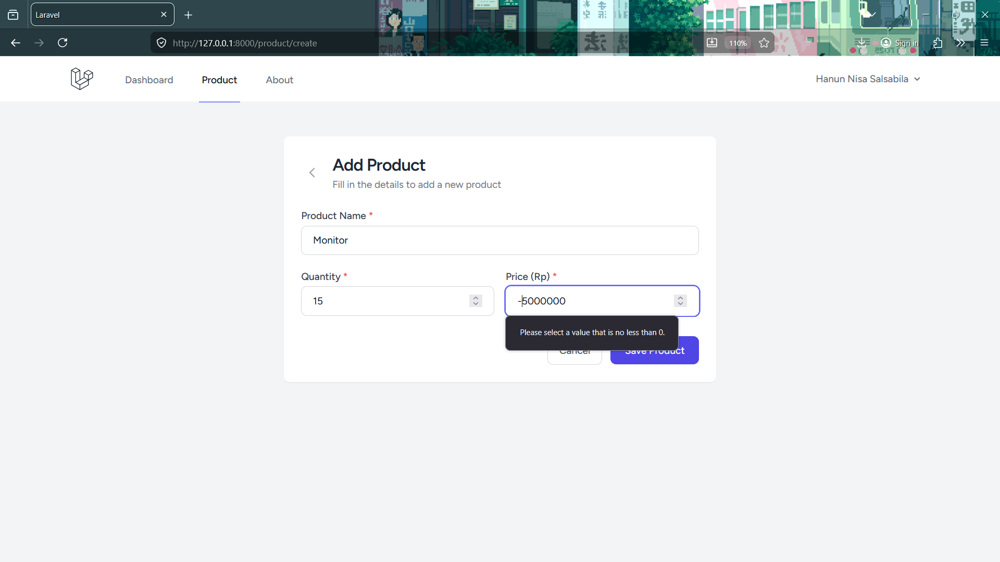
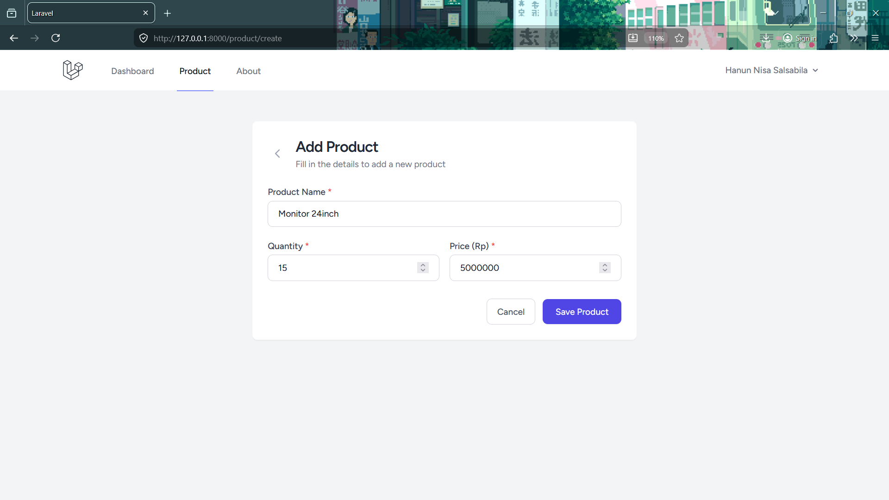
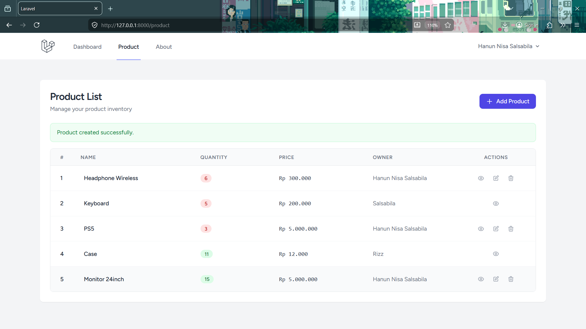

# PPWF Laravel Validation

## Identitas
- Nama: Hanun Nisa Salsabila
- NIM: 20230140130

## Deskripsi
Melanjutkan project minggu kemarin untuk tugas praktikum 6 PWF.

## Screenshot

## Validation Semua Kotak Add Product Kosong

## Product Name
### Validation Kotak Product Name di Add Product Kosong

## Quantity
### Validation Kotak Quantity di Add Product dengan Nilai Kosong 

### Validation Kotak Quantity di Add Product dengan Nilai Minus

### Validation Kotak Quantity di Add Product dengan Nilai Desimal

## Price
### Validation Kotak Price di Add Product dengan Nilai Kosong

### Validation Kotak Price di Add Product dengan Huruf

### Validation Kotak Price di Add Product dengan Nilai Minus

## Semua Kotak Diisi

