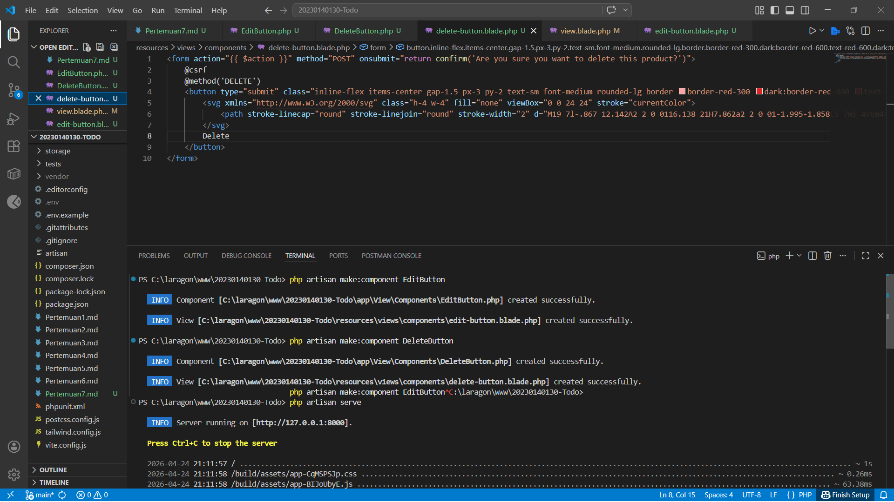
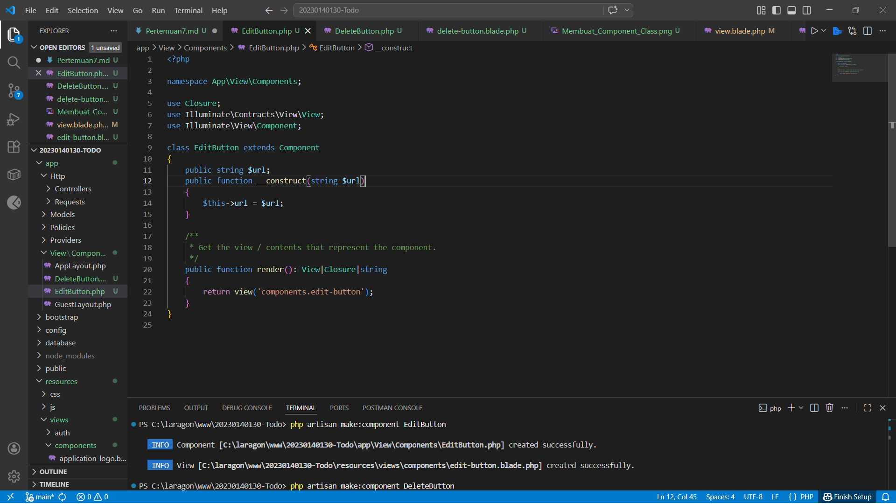
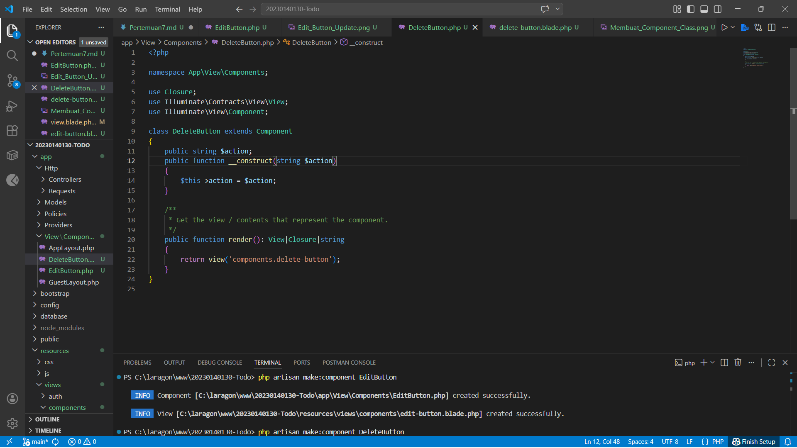
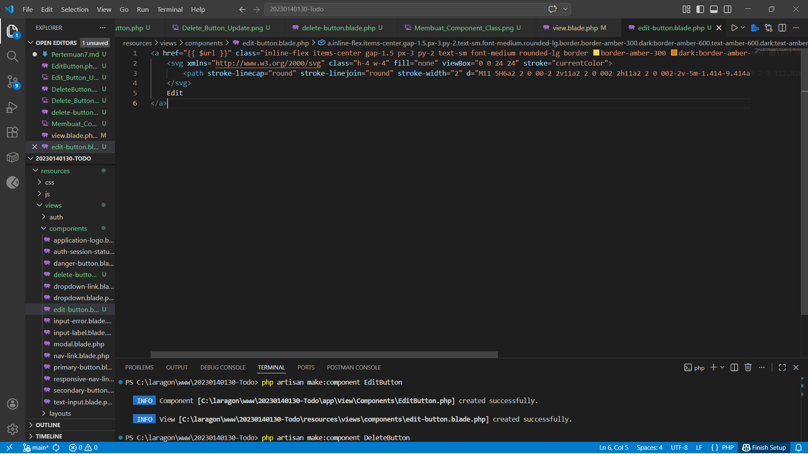
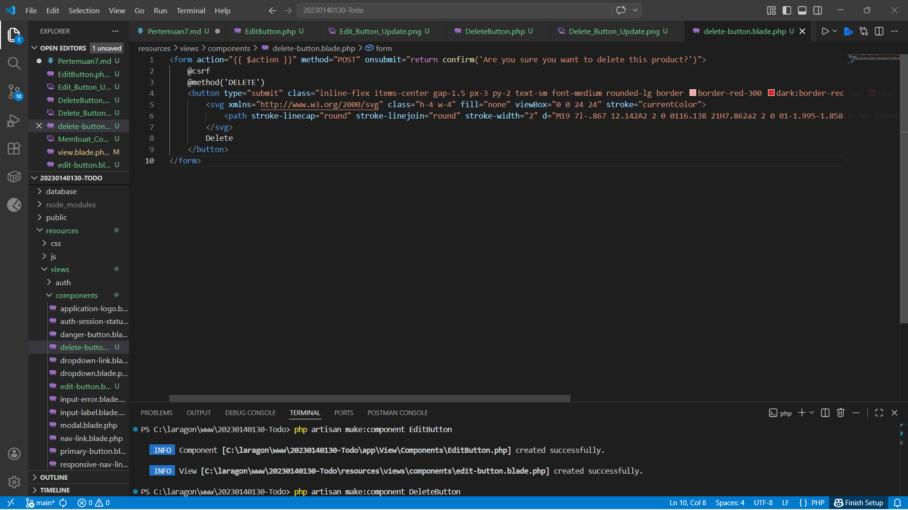
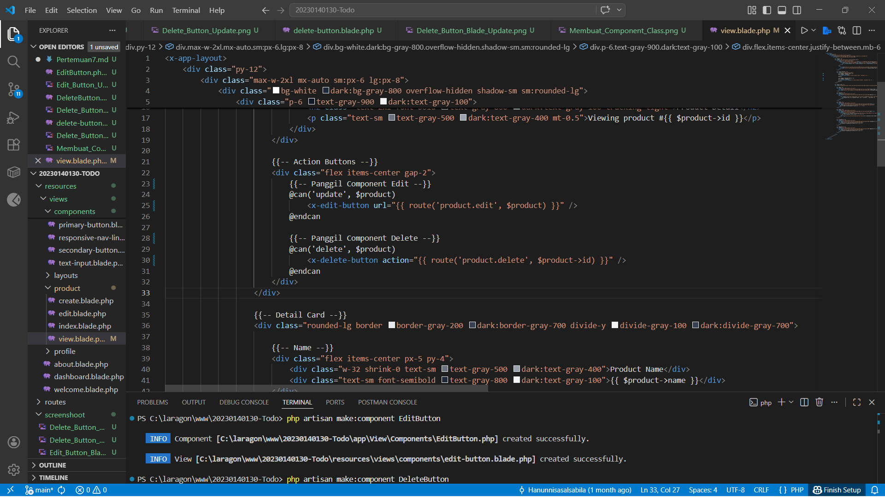
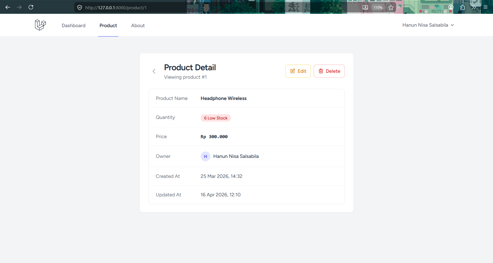

# PPWF Laravel Validation

## Identitas
- Nama: Hanun Nisa Salsabila
- NIM: 20230140130

## Deskripsi
Melanjutkan project minggu kemarin untuk tugas praktikum 7 PWF.

## Screenshot
### Membuat Component Class

### Membuat Blade Component

### Implementasi pada View

### Tampilan Akhir
